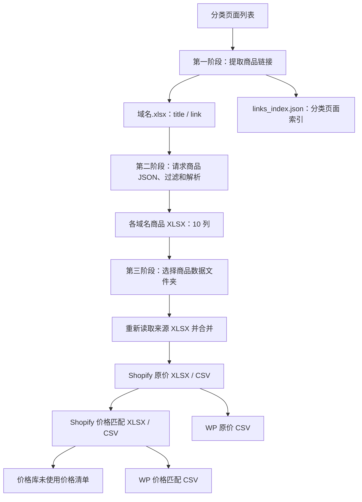

# Shopify 标准采集流程

本目录是独立运行的 Tkinter 工作台，由 `03CRAWLER/standard_collection_process.py` 拆分而来。运行不依赖原单文件。

本文按当前拆分版实现说明操作、数据规则及输出，不以旧版流程报告代替当前行为。更新时间：2026-09-12。

## 1. 安装与启动

建议 Python 3.12；当前依赖要求 Python 3.11 及以上，并需要 tkinter 和本机 Chromium/Chrome。

在本目录执行：

```powershell
python -m pip install -r requirements.txt
python main.py
```

也可以在 IDE 中直接运行 `main.py`。使用项目虚拟环境时，选择 `.venv/Scripts/python.exe` 作为解释器。没有启动或测试批处理脚本。

固定依赖版本：

| 依赖 | 版本 |
|---|---|
| DrissionPage | 4.1.1.4 |
| pandas | 3.0.3 |
| openpyxl | 3.1.5 |

浏览器固定代理为 `http://127.0.0.1:7897`，禁止加载图片。禁图只影响浏览器加载，不影响采集图片 URL。

## 2. 三阶段操作



“运行完整流程”从链接采集开始，各阶段之间需要人工操作，并非一次点击后全部自动完成。顶部提供完整流程、已有 XLSX、继续处理、停止、运行日志及窗口置顶按钮。

### 第一阶段：链接采集

1. 选择链接保存目录。
2. 填写分类列表，每行包含分类标题和分类页面 URL，例如：

```text
Men > Shirts, https://example.com/collections/shirts
Men > Pants, https://example.com/collections/pants
```

3. 根据需要填写 XPath、最大页数。
4. 点击“运行完整流程”。

采集规则：

- 页面文档加载完成后提取数据，不滚动、不点击 Load More。
- XPath 留空：仅从页面 HTML 中的 JSON handle 构造商品链接，不使用 DOM 商品链接回退。
- XPath 非空：仅使用 XPath 提取。
- 最大页数留空或填写 0 表示不设页数上限；后续分页使用 `page=N`。
- 某页没有本分类本轮新发现的链接时，结束该分类。链接已存在历史 XLSX 并不直接导致结束分页。
- 启动浏览器前读取目录内已有链接 XLSX，按规范化商品请求 URL 去重；重复商品保留首次分类。
- 每分类结束时，只保存有新增数据的域名工作簿；读取已有工作簿失败会中止采集。

输出到所选链接目录：

| 文件 | 内容 |
|---|---|
| `域名.xlsx` | 两列 `title / link`，保存分类标题与商品链接 |
| `links_index.json` | 域名 → 分类标题 → 分类 URL 列表 |

索引记录分类页面，不是商品 JSON。已有索引按分类 URL 追加去重，兼容分类 URL 为单个字符串的旧值。索引采用直接 JSON 写入，不属于 XLSX 原子保存机制。

### 第二阶段：商品采集

也可以跳过第一阶段，选择已有链接目录并点击“仅处理已有 XLSX”。

1. 在文件列表中为各文件设置“跳过图片位置”和“保留图片位置”。
2. 点击“继续处理”。
3. 程序读取链接表活动工作表，从第二行按列位置获取分类标题和商品 URL。
4. 请求商品 `.json`，解析后保存对应域名的商品 XLSX。
5. 完成后，第三阶段默认填入对应的商品输出文件夹，可另行选择。

正常采集完成后只保存来源商品表，合并由第三阶段执行。停止或异常时可能另存应急合并表。

#### 输出路径

商品文件路径直接将输入完整路径中的 `01INPUT_XLSX` 替换为 `02OUTPUT_XLSX`，例如：

```text
01INPUT_XLSX/男装/example.com.xlsx
              ↓
02OUTPUT_XLSX/男装/example.com.xlsx
```

GUI 不强制目录名称。路径不含 `01INPUT_XLSX` 时替换无效，商品输出可能覆盖原链接表；文件名中出现相同文字也会被替换。建议使用上面的输入、输出目录约定。

#### 续采

- 单个输入文件内先按规范化 `.json` 请求 URL 去重，同一请求保留首次分类。
- 续采精确比较已有商品 `link-href` 与目标 `original_url`，相同即跳过，不额外检查商品名。
- 修改 KEEP、SKIP 或规格过滤配置不会重新加工已完成记录。
- 新文件不再写入 `_crawl_config` 隐藏表，读取旧文件时也不使用该表。
- 若要重新加工已有商品，应先备份输出，再移除相应输出记录或输出文件，随后重新采集。

### 第三阶段：选择文件夹、合并并转换

此阶段选择的是**包含商品数据 XLSX 的文件夹**，不是单个文件，也不是两列链接表目录。

点击“选择文件夹”，再点击“合并并转换”：

1. 重新扫描所选目录直属的 XLSX，扩展名不区分大小写。
2. 按文件名排序，读取所有来源表。
3. 校验每个文件具有完整的 10 个商品字段，忽略全空记录。
4. 直接拼接记录，不做跨文件商品去重。
5. 原子保存为所选目录下的 `文件夹名_合并.xlsx`。
6. 读取合并表，生成 Shopify 原价文件。
7. 重新读取 Shopify 原价 XLSX，匹配价格并导出。
8. 读取实际 `csv/` 中的原价及价格匹配 CSV，分别生成 WP 文件。

默认排除：

- 以 `~$` 开头的 Excel 锁文件。
- 文件名前缀（不含扩展名）以 `_合并` 结尾的表。
- 文件名包含 `_Shopify_` 的导出表，不区分大小写。
- 所有子目录，包括 `xlsx/`、`csv/`。

这意味着重复运行不会把本程序的旧合并结果再次纳入。人工另存的其他备份 XLSX 若不符合排除规则，也会参与合并。

暂停期间手动编辑来源表，第三阶段会读取编辑后的文件。已取消使用采集内存结果作为第三阶段合并来源。

没有来源文件、所有来源为空、文件损坏或缺列时中止；所有来源读取及校验完成前，不覆盖已有合并表。转换失败后可以修正文件再重试。

## 3. 商品数据规则

### 商品 JSON 和中间表

验证 `product` 对象、正整数商品 ID、非空 title/handle、非空 variants、正整数变体 ID 和有限非负价格；options/images 必须为对象列表。无效 JSON 不记为成功商品。

来源表和合并表均为以下 10 列：

| 字段 | 含义 |
|---|---|
| `title` | 来源分类标题 |
| `name` | 商品名称 |
| `price1` | 回退变体售价，经过价格格式化 |
| `price2` | 回退变体划线价，零值或缺省时回退售价 |
| `styles1` | 规格、价格和变体图片编码 |
| `styles2` / `styles3` | 当前采集固定为空；转换器可读取已有的这两列 |
| `src_links` | 全部过滤后图库，使用 `#` 分隔 |
| `link-href` | 原始商品链接，去除查询参数和 fragment |
| `details` | 清理后的详情 HTML |

原始商品 JSON 不另存为文件。

### 规格及转义

- 按原 position 排序，按 SKIP_OPTIONS 关键词过滤，只保留有多个值的选项。
- 名称包含 size 或全部值属于尺码集合时，名称统一为 `Size`。
- 其他多值 `Type` 选项改名为 `Style`，尺码识别优先。
- 名为 Color 的选项放到最前，但匹配变体时保留原 position 对应关系。
- 对保留选项做笛卡尔积；不按真实存在或库存过滤组合。
- 优先匹配完整组合，否则按首个保留选项回退，最后使用 position=1 或首个变体。
- 首个选项值决定关联图片，同值的其他规格组合共用首个匹配图片。

规格段示例：

```text
Color#Red&Size&S$19.99$24.99@https://cdn.example.com/red_600x600.jpg
```

选项名称和值中的 `&`、`#`、`@`、反斜杠会转义；转换时按未转义分隔符切分并还原。`$` 不在转义集合中，价格按最右两个 `$` 解析。价格和图片 URL 本身不转义。

`styles1` 长度上限为 config.py 的 `MAX_STYLES_LENGTH`（32000 字符）。超过上限时抛 `InvalidProductError`，商品整体跳过，不写入来源表和合并表，日志记录实际长度与上限。取 32000 而非 Excel 单元格上限 32767，是为边界问题和 `styles2`/`styles3` 可能启用留出余量。组合数极多的商品会因此被排除，这是有意的取舍——写入后被截断的 styles1 会静默损坏数据。

### 图片 KEEP / SKIP

| 输入 | 行为 |
|---|---|
| 两者留空 | 不过滤 |
| KEEP 填 `1,3` | 只保留对应 position，忽略 SKIP |
| KEEP 留空、SKIP 填 `1,3` | 排除对应 position |
| `-1`、`-2` | 按排序去重后的 position 值倒数定位，越界忽略 |
| 中文逗号、全角负号 | 与英文逗号、普通负号统一解析 |
| 非空 KEEP 但没有有效整数 | 得到空保留列表，全部过滤 |

位置基于 JSON 的 position 值，不保证等于原列表下标；不再为缺少 position 的图片另设最后一张回退。

图库保存过滤后的全部图片，并去重补入首个保留选项的图片映射。没有原先的 5 张限制。图片 URL 在扩展名前添加 `_600x600`，保留 query/fragment；无扩展名不添加，已有尺寸后缀不自动去重。

### 详情清理

删除 `<a>` 标签但保留文字，删除 ``；其他标签仅保留标签名，移除属性。文本进行 HTML 转义并过滤 U+FFFF 以上字符，再循环清理空标签。该处理是商品内容清洗，不是完整的 HTML 安全净化器。

## 4. 价格与导入格式

### 采集价格

当前按确认的基准规则处理字符串形式：

```text
"100"    → "1"       无小数点，按分除以 100
"100.00" → "100"     有小数点，按主货币单位
"19.90"  → "19.9"    最多两位小数并去尾零
```

只有汇率和变体的 `price_currency` 均可用时才尝试换汇；非 USD 金额除以对应汇率。缺少币种或汇率时沿用原金额进行上述格式化，不能保证统一为美元。采集阶段的零 `compare_at_price`（包括字符串零）回退到售价。

### Shopify 转换及价格匹配

Shopify 原价表为 49 列。一个商品展开为多个变体行；图库图片更多时，额外增加纯图片行。Handle 和变体 SKU 每次转换随机生成并在本次转换内去重；变体 SKU 格式为 `123AB-C12DE-456AB`，共 17 字符。

价格匹配规则：

1. 使用固定价格库，当前 215 个价格，范围 8.99～599。
2. 按 Handle 分组，pandas 默认按 Handle 排序；组内按原售价升序处理。
3. 每个变体独立计算原售价的 75%～125% 闭区间。
4. 从尚未使用的价格中取区间内最小值，不是最近值。
5. 每个价格值在本次整份文件内最多使用一次。
6. 命中时售价替换为匹配价，划线价设为匹配价 × 1.2，保留两位小数。
7. 未命中行保留原价；额外的“匹配价格”列留空。

尚未实施统一商品基准价、自动补价或允许重复价格的阶梯方案。变体较多时可能耗尽可用价格。

| 输出类型 | 内容 |
|---|---|
| Shopify 原价 | 全部匹配前记录，49 列 |
| Shopify 价格匹配 | 保留全部记录，命中行更新价格，新增匹配价格列，共 50 列 |
| 未匹配到的价格 | 价格库剩余数值，只有未匹配价格一列；不是匹配失败商品 |

重新读取 Excel 后，数字和布尔值可能以 `1.0`、`True` 等形式写入 CSV。每次转换重新生成随机 Handle，也可能影响不同商品获取价格的先后顺序。

### WP / WooCommerce

输出 26 列，不含 Tags。首行 Option1 Value 非空且不是 Default Title 时，创建 variable 父体及各 variation，包含第一个有效变体；否则按 simple 商品处理。纯图片行只补充父体图库。

父体汇总图片和属性值，变体价格来自 Shopify 数据。父 SKU 根据 Handle 生成，变体使用 Shopify 变体 SKU。父体无价格，子变体分别定价。

WP 价格校验仅在售价和原价均大于零且售价更高时，将 Regular price 设为 Sale price。字符串 `"0"`、`"0.00"` 不在该修正规则内；这与采集阶段零划线价回退是两个环节。

价格匹配版 WP 路径已修正，使用实际 `csv/` 目录中的匹配文件。

## 5. 完整输出示例

链接目录为 `01INPUT_XLSX/男装/`，第三阶段选择 `02OUTPUT_XLSX/男装/`：

```text
01INPUT_XLSX/男装/
├── example.com.xlsx
└── links_index.json

02OUTPUT_XLSX/男装/
├── example.com.xlsx
├── 男装_合并.xlsx
├── xlsx/
│   ├── 男装_合并_Shopify_原价.xlsx
│   ├── 男装_合并_Shopify_价格匹配.xlsx
│   └── 男装_合并_Shopify_未匹配到的价格.xlsx
└── csv/
    ├── 男装_合并_Shopify_原价.csv
    ├── 男装_合并_Shopify_价格匹配.csv
    ├── 男装_合并_Shopify_未匹配到的价格.csv
    └── wp-男装_合并/
        ├── wp-男装_合并_Shopify_原价.csv
        └── wp-男装_合并_Shopify_价格匹配.csv
```

未使用价格清单只在仍有剩余价格时生成；代码不会自动删除上次遗留的同名文件。其他同名转换输出会覆盖，不生成时间戳版本。

## 6. 停止、异常和保存

| 情况 | 当前行为 |
|---|---|
| 第一、二阶段点击停止 | 设置停止标记，等待当前操作返回并保存已有数据，GUI 保持打开 |
| 正常商品采集 | 每累计 20 次成功保存；文件结束保存尚未保存的结果 |
| 单个商品判定无效 | JSON 结构校验失败、或 styles1 超过 `MAX_STYLES_LENGTH` 时跳过该商品，失败计数 +1，日志给出原因；已采集的其他商品照常保存 |
| 商品采集停止或异常 | 保存已采集来源数据，必要时写入应急合并表，再关闭浏览器 |
| 第一、二阶段未捕获异常 | 记录堆栈、请求保存后关闭程序 |
| 关闭窗口 | 等待后台任务结束，重试待保存快照，成功后关闭 |
| XLSX 保存失败 | 保留内存快照；解除文件占用后关闭窗口重试，第三阶段还可通过合并按钮触发重试 |
| 第三阶段未捕获异常 | 显示失败并保持 GUI，可修正文件后重新运行 |
| WP 转换内部异常 | 仅记录日志；外层仍可能显示完成，需检查两份 WP 输出日志及文件 |

停止不是强制终止线程，网络请求或浏览器操作返回前可能需要等待。当前停止按钮只对第一、二阶段启用；关闭窗口也不会强行打断第三阶段转换。

原子保存用于链接 XLSX、商品 XLSX 和合并 XLSX：先写同目录临时文件再替换目标。Shopify 导出、WP CSV 和 links_index.json 为普通写入，不具备同样的原子保存保证。

## 7. 代码结构与维护入口

```text
main.py                   独立启动入口
config.py                 固定代理、重试、默认选项过滤
ui/
  app.py                  主窗口、输入校验、事件消费、三阶段按钮
  components.py           文件列表及 KEEP/SKIP 控件
  log_window.py           运行日志窗口
  theme.py                样式
pipeline/
  models.py               任务配置、状态和事件
  controller.py           后台线程、停止、关闭与失败处理
  link_task.py            分页采集、链接去重和索引保存
  product_task.py         商品采集、续采、周期保存及应急保存
  conversion_task.py      文件夹合并、转换和导出调度
crawler/
  browser.py              浏览器创建、固定代理、禁图
  links.py                handle / XPath 链接提取
  product_api.py          商品 JSON 请求
processing/
  product.py              JSON 校验、styles1 长度上限、10 字段组装
  options.py              规格过滤、Size/Style 改名及排序
  variants.py             全组合、变体匹配及价格回退
  style_codec.py          规格分隔符转义、切分和还原
  images.py               KEEP/SKIP、position 解析、图片映射
  html_cleaner.py          详情 HTML 清理
  currency.py             汇率、采集价格单位和零价回退
  cells.py                单元格规范化
  shopify.py              商品表转 Shopify
  pricing.py              价格库匹配
  woocommerce.py          Shopify 行转 WP
storage/
  merge.py                来源文件扫描、排除、校验及拼接
  workbooks.py            链接/商品表读取及 XLSX 原子保存
  checkpoints.py          失败保存快照和重试
  paths.py                商品 URL、路径映射、分类输入解析
  tables.py               通用表格读取和转换导出
  exports.py              输出命名、目录及 WP CSV 写入
resources/
  columns.py              输出列定义
  price_library.py        固定价格库
tests/                    离线回归及 Tk 界面测试
```

后台不导入 Tk、不操作控件；通过线程安全队列发送日志、进度和结果，由主线程消费。没有临时替换全局函数或重定向全局 stdout/stderr。

processing 负责计算，storage 负责读写，pipeline 串联步骤。修改数据规则优先定位 processing；修改文件夹合并优先定位 storage/merge.py；修改状态与恢复优先定位 pipeline/controller.py。

当前 `SKIP_OPTIONS=None`，默认不跳过任何选项，并非旧报告里的固定 ships from。页面加载等待 30 秒；链接首页空结果最多重试 5 次，间隔 5 秒；商品请求最多重试 5 次，429 按 30 秒倍数退避。`MAX_STYLES_LENGTH=32000` 控制 styles1 长度上限。

## 8. 测试与验证范围

在本目录执行：

```powershell
python -m unittest discover -s tests -v
```

最近验证：55 项测试通过。覆盖规格转义、styles1 长度上限（含阈值边界）、超长商品跳过且不产出文件、图片过滤、价格规则、精确 URL 续采、文件夹合并、重复运行排除旧输出、错误来源保护旧合并表、保存失败恢复、停止保存及真实 Tk 窗口初始化。

测试使用临时目录和模拟浏览器，不访问真实商店；Tk 测试需要可用桌面环境。

`tests/fixtures/reference.json` 保存拆分前对照。已改变的规则使用新的预期；转换结果同时采用文本对照或表格语义对照，不代表全部输出与旧版逐字节一致。
