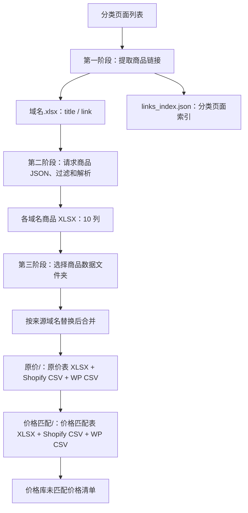

# Shopify 标准采集流程

本目录是独立运行的 Tkinter 工作台，由 `03CRAWLER/standard_collection_process.py` 拆分而来。运行不依赖原单文件。

本文按当前拆分版实现说明操作、数据规则及输出，不以旧版流程报告代替当前行为。更新时间：2026-09-15。

## 1. 安装与启动

建议 Python 3.12；当前依赖要求 Python 3.11 及以上，并需要 tkinter 和本机 Chromium/Chrome。

在本目录执行：

```powershell
python -m pip install -r requirements.txt
python main.py
```

也可以在 IDE 中直接运行 `main.py`。使用项目虚拟环境时，选择 `.venv/Scripts/python.exe` 作为解释器。没有启动或测试批处理脚本。

固定依赖版本：

| 依赖 | 版本 |
|---|---|
| DrissionPage | 4.1.1.4 |
| pandas | 3.0.3 |
| openpyxl | 3.1.5 |

浏览器固定代理为 `http://127.0.0.1:7897`，禁止加载图片。禁图只影响浏览器加载，不影响采集图片 URL。

## 2. 三阶段操作



“运行完整流程”从链接采集开始，各阶段之间需要人工操作，并非一次点击后全部自动完成。顶部提供完整流程、已有 XLSX、继续处理、停止、运行日志及窗口置顶按钮。

### 第一阶段：链接采集

1. 选择链接保存目录。
2. 填写分类列表，每行包含分类标题和分类页面 URL，例如：

```text
Men > Shirts, https://example.com/collections/shirts
Men > Pants, https://example.com/collections/pants
```

3. 根据需要填写 XPath、最大页数。
4. 点击“运行完整流程”。

采集规则：

- 页面文档加载完成后提取数据，不滚动、不点击 Load More。
- XPath 留空：仅从页面 HTML 中的 JSON handle 构造商品链接，不使用 DOM 商品链接回退。
- XPath 非空：仅使用 XPath 提取。
- 最大页数留空或填写 0 表示不设页数上限；后续分页使用 `page=N`。
- 某页没有本分类本轮新发现的链接时，结束该分类。链接已存在历史 XLSX 并不直接导致结束分页。
- 启动浏览器前读取目录内已有链接 XLSX，按规范化商品请求 URL 去重；重复商品保留首次分类。
- 每分类结束时，只保存有新增数据的域名工作簿；读取已有工作簿失败会中止采集。

输出到所选链接目录：

| 文件 | 内容 |
|---|---|
| `域名.xlsx` | 两列 `title / link`，保存分类标题与商品链接 |
| `links_index.json` | 域名 → 分类标题 → 分类 URL 列表 |

索引记录分类页面，不是商品 JSON。已有索引按分类 URL 追加去重，兼容分类 URL 为单个字符串的旧值。索引采用直接 JSON 写入，不属于 XLSX 原子保存机制。

### 第二阶段：商品采集

也可以跳过第一阶段，选择已有链接目录并点击“仅处理已有 XLSX”。

1. 在文件列表中为各文件设置“跳过图片位置”和“保留图片位置”。
2. 点击“继续处理”。
3. 程序读取链接表活动工作表，从第二行按列位置获取分类标题和商品 URL。
4. 请求商品 `.json`，解析后保存对应域名的商品 XLSX。
5. 完成后，第三阶段默认填入对应的商品输出文件夹，可另行选择。

正常采集完成后只保存来源商品表，合并由第三阶段执行。停止或异常时可能另存应急合并表。

#### 输出路径

商品文件路径直接将输入完整路径中的 `01INPUT_XLSX` 替换为 `02OUTPUT_XLSX`，例如：

```text
01INPUT_XLSX/男装/example.com.xlsx
              ↓
02OUTPUT_XLSX/男装/example.com.xlsx
```

GUI 不强制目录名称。路径不含 `01INPUT_XLSX` 时替换无效，商品输出可能覆盖原链接表；文件名中出现相同文字也会被替换。建议使用上面的输入、输出目录约定。

#### 续采

- 单个输入文件内先按规范化 `.json` 请求 URL 去重，同一请求保留首次分类。
- 续采精确比较已有商品 `link-href` 与目标 `original_url`，相同即跳过，不额外检查商品名。
- 修改 KEEP、SKIP 或规格过滤配置不会重新加工已完成记录。
- 新文件不再写入 `_crawl_config` 隐藏表，读取旧文件时也不使用该表。
- 若要重新加工已有商品，应先备份输出，再移除相应输出记录或输出文件，随后重新采集。

### 第三阶段：选择文件夹、合并并转换

此阶段选择的是**包含商品数据 XLSX 的文件夹**，不是单个文件，也不是两列链接表目录。

点击“选择文件夹”，再点击“合并并转换”：

1. 重新扫描所选目录直属的 XLSX，扩展名不区分大小写。
2. 按文件名排序，读取所有来源表。
3. 校验每个文件具有完整的 10 个商品字段，忽略全空记录。
4. 剔除 `name` 命中 `EXCLUDE_NAME_KEYWORDS` 的商品行。
5. 整词替换域名：把 name / details 中的来源站域名（含词内嵌入）整体替换为目标站域名。
6. 直接拼接记录，不做跨文件商品去重。
7. 原子保存为所选目录下的 `文件夹名_合并.xlsx`。
8. 读取合并表，先做原价修正，再做价格匹配（均在内存中进行）。
9. 输出布局对齐 `Styles_递增价格匹配.py`：原价修正表写入 `原价/`，价格匹配表写入 `价格匹配/`，各自再输出同名的 `_Shopify.csv`，WP 紧随其后写成 `wp-<Shopify文件名>`。

#### 域名替换

来源表文件名是来源站域名，文件夹名开头是目标站域名，两者都取第一段标签：`www.thefinespun.com.xlsx` → `thefinespun`，`delfias.com女装-礼服/` → `delfias`。识别规则是「去掉开头的 `www.`，取第一个点之前的部分」，因此 `eviesplussizefashions.com.au` → `eviesplussizefashions`、`creationsbydonnamnaumann.myshopify.com` → `creationsbydonnamnaumann`。

替换只作用于 `name` 和 `details` 两列，大小写不敏感，统一写为目标标签的小写形式。`link-href`、`src_links`、`styles1` 不改动。

替换以整个「词」为单位，不做子串半截替换：标签若嵌在更长的词里，整个词都换成目标标签。「词」由字母、数字、`-`、`_` 组成。

| 原文 | 结果 |
|---|---|
| `dressmezee Goodbyes Lurex Drape Mini Dress - Blue` | `delfias Goodbyes Lurex Drape Mini Dress - Blue` |
| `Bitterdressmezee Symphony Lace Cut Out Mini Dress - Black` | `delfias Symphony Lace Cut Out Mini Dress - Black` |
| `dressmezeeest Sin Detachable Sleeve Mini Dress - Black` | `delfias Sin Detachable Sleeve Mini Dress - Black` |

第一行是空格分隔的前缀，后两行是词内嵌入：词内的 `Bitter`、`est` 不作为独立信息保留，随整词一起被目标标签取代。

文件夹名或来源表名识别不出域名时不替换，来源与目标标签相同时也不替换。命中处数按标签出现次数计，写入运行日志，例如 `域名替换: dressmezee → delfias，命中 17 处`。

来源表只能放在所选目录直属位置：来源站域名取自这些文件名，放进子目录会被忽略，替换也就不会发生。

默认排除：

- 以 `~$` 开头的 Excel 锁文件。
- 文件名前缀（不含扩展名）以 `_合并` 结尾的表。
- 文件名包含 `_Shopify` 的导出表，不区分大小写。
- 所有子目录，包括 `原价/`、`价格匹配/`。

这意味着重复运行不会把本程序的旧合并结果再次纳入。人工另存的其他备份 XLSX 若不符合排除规则，也会参与合并。

暂停期间手动编辑来源表，第三阶段会读取编辑后的文件。已取消使用采集内存结果作为第三阶段合并来源。

没有来源文件、所有来源为空、文件损坏或缺列时中止；所有来源读取及校验完成前，不覆盖已有合并表。转换失败后可以修正文件再重试。

## 3. 商品数据规则

### 商品 JSON 和中间表

验证 `product` 对象、正整数商品 ID、非空 title/handle、非空 variants、正整数变体 ID 和有限非负价格；options/images 必须为对象列表。无效 JSON 不记为成功商品。

来源表和合并表均为以下 10 列：

| 字段 | 含义 |
|---|---|
| `title` | 来源分类标题 |
| `name` | 商品名称 |
| `price1` | 回退变体售价，经过价格格式化 |
| `price2` | 回退变体划线价，零值或缺省时回退售价 |
| `styles1` | 规格、价格和变体图片编码 |
| `styles2` / `styles3` | 当前采集固定为空；转换器可读取已有的这两列 |
| `src_links` | 全部过滤后图库，使用 `#` 分隔 |
| `link-href` | 原始商品链接，去除查询参数和 fragment |
| `details` | 清理后的详情 HTML |

原始商品 JSON 不另存为文件。

### 规格及转义

- 按原 position 排序，按 SKIP_OPTIONS 关键词过滤，只保留有多个值的选项。
- 名称包含 size 或全部值属于尺码集合时，名称统一为 `Size`。
- 其他多值 `Type` 选项改名为 `Style`，尺码识别优先。
- 名为 Color 的选项放到最前，但匹配变体时保留原 position 对应关系。
- 对保留选项做笛卡尔积；不按真实存在或库存过滤组合。
- 优先匹配完整组合，否则按首个保留选项回退，最后使用 position=1 或首个变体。
- 首个选项值决定关联图片，同值的其他规格组合共用首个匹配图片。

规格段示例：

```text
Color#Red&Size&S$19.99$24.99@https://cdn.example.com/red_600x600.jpg
```

选项名称和值中的 `&`、`#`、`@`、反斜杠会转义；转换时按未转义分隔符切分并还原。`$` 不在转义集合中，价格按最右两个 `$` 解析。价格和图片 URL 本身不转义。

`styles1` 长度上限为 config.py 的 `MAX_STYLES_LENGTH`（32000 字符）。超过上限时抛 `InvalidProductError`，商品整体跳过，不写入来源表和合并表，日志记录实际长度与上限。取 32000 而非 Excel 单元格上限 32767，是为边界问题和 `styles2`/`styles3` 可能启用留出余量。此规则与 `standard_collection_process` 同步。

### 图片 KEEP / SKIP

| 输入 | 行为 |
|---|---|
| 两者留空 | 不过滤 |
| KEEP 填 `1,3` | 只保留对应 position，忽略 SKIP |
| KEEP 留空、SKIP 填 `1,3` | 排除对应 position |
| `-1`、`-2` | 按排序去重后的 position 值倒数定位，越界忽略 |
| 中文逗号、全角负号 | 与英文逗号、普通负号统一解析 |
| 非空 KEEP 但没有有效整数 | 得到空保留列表，全部过滤 |

位置基于 JSON 的 position 值，不保证等于原列表下标；不再为缺少 position 的图片另设最后一张回退。

图库保存过滤后的全部图片，并去重补入首个保留选项的图片映射。没有原先的 5 张限制。图片 URL 在扩展名前添加 `_600x600`，保留 query/fragment；无扩展名不添加，已有尺寸后缀不自动去重。

### 详情清理

删除 `<a>` 标签但保留文字，删除 ``；其他标签仅保留标签名，移除属性。文本进行 HTML 转义并过滤 U+FFFF 以上字符，再循环清理空标签。该处理是商品内容清洗，不是完整的 HTML 安全净化器。

### 商品排除关键词

`config.py` 的 `EXCLUDE_NAME_KEYWORDS` 列出关键词，合并时 `name` 命中任一关键词的商品整行剔除。这一步早于域名替换和价格处理，被剔除的商品不进入原价表、价格匹配表、Shopify 和 WP 的任何输出。

按整体字面量匹配，大小写不敏感：每个条目整体作为子串查找，条目里的空格也是要匹配的字符，所以 `Gift Card` 命中 `Shop Vista Gift Card`，不命中 `Cardigan`。条目互相独立，增删其中一条不影响其他条目。关键词列表为空或全是空白时不剔除任何行。

剔除结果只写日志，格式为 `排除: 命中 Gift Card → <商品名>`，并在每个来源文件之后输出一行合计。不产出被剔除商品的清单文件。

## 4. 价格与导入格式

### 采集价格

当前按确认的基准规则处理字符串形式：

```text
"100"    → "1"       无小数点，按分除以 100
"100.00" → "100"     有小数点，按主货币单位
"19.90"  → "19.9"    最多两位小数并去尾零
```

只有汇率和变体的 `price_currency` 均可用时才尝试换汇；非 USD 金额除以对应汇率。缺少币种或汇率时沿用原金额进行上述格式化，不能保证统一为美元。采集阶段的零 `compare_at_price`（包括字符串零）回退到售价。

### 原价修正与价格匹配

转换链路为：合并表 → 原价修正 → 价格匹配 → 转 Shopify → 转 WP。前两步在内存中进行，不写中间表。

**原价修正**（对齐 `Styles_递增价格匹配.py`）：

1. 行级：`price2 < price1` 时，`price2` 置为 `price1`。
2. 变体级：`styles1` 内嵌价 `p2 < p1` 时，`p2` 置为 `p1`，沿用原文本以免 `20.00` 被改写成 `20.0`。

**价格匹配**（`processing/pricing.py`）：

1. 使用固定价格库，当前 215 个价格，范围 8.99～599。
2. 逐行解析 `styles1`，只处理含变体的行；原价取 `price2`，无效或非正时回退 `price1`，两者都无效时该行不参与匹配。
3. 按全文件的**唯一原价**排序计算百分位：最低唯一原价记 0，最高记 1，相同原价百分位相同。全文件只有一种原价时统一取 0.5。
4. 用百分位查倍率区间，原价越低允许的折扣越深：

   | 原价百分位 | 倍率区间 |
   |---|---|
   | ≤ 0.10 | [0.20, 0.80] |
   | ≤ 0.30 | [0.40, 0.90] |
   | ≤ 0.70 | [0.60, 1.10] |
   | ≤ 0.90 | [0.70, 1.30] |
   | ≤ 1.00 | [0.80, 1.50] |

5. 目标价 = 区间下端 + （区间上端 − 区间下端）× 百分位，百分位越低越靠近区间低端。
6. 候选池分三层取：

   - 第一层：倍率区间内的全部库价；
   - 第二层：区间内仍为空时，按 0.10、0.20 依次向两侧扩张后再取；
   - 第三层：仍为空时，取离目标价最近的 `max(12, 变体数 × 4)` 个库价。

   第三层是原价远高于 599 时的兜底，避免高价商品因「优先用没被用过的价」而落到 8.99。
7. 给变体分配：候选按「全局使用次数 → 与目标价的归一化距离 → 价格」升序排序，取前「变体数」个；候选不足变体数时，先把不同价格各用一次，再按「全局使用次数 + 本行已用次数 → 距离 → 价格」重复补齐。最终按价格升序对应回 `styles1` 的变体顺序。
8. 全局使用次数在同一文件内累计，因此**分配结果与行序有关**：换一种行序，少数商品的匹配价和未使用价格数可能变化。同一价格仍可出现在多个商品中，不按 Handle 分组。
9. 命中后行级 `price1` 写本商品最小匹配价，`price2` 写最大匹配价；`styles1` 每个变体重建为 `$自己的匹配价$本商品最大匹配价`，未命中的变体保留原片段。

原价远高于价格库上限（599）时不再统一取 599，而是走第 3～6 条：处在最高百分位的行，区间 `[0.8 × 原价, 1.5 × 原价]` 可能只含 599，此时全部变体取 599；区间还含其他库价时按第 7 条分配。实测全文件最高原价 700 得 `[599, 599, 599]`，原价 520 得 `[499, 519, 599]`。

| 输出类型 | 内容 |
|---|---|
| 原价表 `原价/<表名>_原价.xlsx` | 原价修正后的 10 列商品表 |
| 价格匹配表 `价格匹配/<表名>_价格匹配.xlsx` | 匹配后的 10 列商品表 |
| Shopify 原价 `原价/<表名>_原价_Shopify.csv` | 修正后的原价，49 列，只输出 CSV |
| Shopify 价格匹配 `价格匹配/<表名>_价格匹配_Shopify.csv` | 命中行更新价格，新增匹配价格列，共 50 列，只输出 CSV |
| 未匹配到的价格 `价格匹配/<表名>_未匹配到的价格.csv` | 价格库中未被任何商品用到的数值，只有未匹配价格一列；不是匹配失败商品。始终生成，可能只有表头 |

`<表名>` 是合并表名，例如 `delfias.com女装-礼服_合并`。目录、文件名与 Shopify 只输出 CSV 这几点都与 `Styles_递增价格匹配.py` 相同；价格匹配版的差异是多出匹配价格列，且匹配算法已与 Styles 脚本不同（见第 8 节）。

重新读取 Excel 后，数字和布尔值可能以 `1.0`、`True` 等形式写入 CSV。Handle 和变体 SKU 每次转换随机生成并在本次转换内去重；变体 SKU 格式为 `123AB-C12DE-456AB`，共 17 字符。

### WP / WooCommerce

输出 26 列，不含 Tags。首行 Option1 Value 非空且不是 Default Title 时，创建 variable 父体及各 variation，包含第一个有效变体；否则按 simple 商品处理。纯图片行只补充父体图库。

父体汇总图片和属性值，变体价格来自 Shopify 数据。父 SKU 由 Handle 经 md5 派生的 8 位数字生成（`SKU########`），变体使用 Shopify 变体 SKU。variable 父体的 Sale price 与 Regular price 均为空，价格只挂在子变体上。

WP 侧不做价格校验：原「Regular price 低于售价时统一为 Sale price」的逻辑已移除，对齐 `Styles_递增价格匹配.py`。采集阶段的零划线价回退是独立环节，不受此影响。

WP 文件与对应的 Shopify CSV 同目录，文件名为 `wp-<Shopify文件名>`，不使用子目录。

## 5. 完整输出示例

链接目录为 `01INPUT_XLSX/男装/`，第三阶段选择 `02OUTPUT_XLSX/男装/`：

```text
01INPUT_XLSX/男装/
├── example.com.xlsx
└── links_index.json

02OUTPUT_XLSX/男装/
├── example.com.xlsx
├── 男装_合并.xlsx
├── 原价/
│   ├── 男装_合并_原价.xlsx
│   ├── 男装_合并_原价_Shopify.csv
│   └── wp-男装_合并_原价_Shopify.csv
└── 价格匹配/
    ├── 男装_合并_价格匹配.xlsx
    ├── 男装_合并_价格匹配_Shopify.csv
    ├── 男装_合并_未匹配到的价格.csv
    └── wp-男装_合并_价格匹配_Shopify.csv
```

`原价/` 与 `价格匹配/` 的子目录结构、文件名与 `Styles_递增价格匹配.py` 一致。未匹配价格清单始终生成；代码不会自动删除上次遗留的同名文件。其他同名转换输出会覆盖，不生成时间戳版本。

## 6. 停止、异常和保存

| 情况 | 当前行为 |
|---|---|
| 第一、二阶段点击停止 | 设置停止标记，等待当前操作返回并保存已有数据，GUI 保持打开 |
| 正常商品采集 | 每累计 20 次成功保存；文件结束保存尚未保存的结果 |
| 单个商品判定无效 | JSON 结构校验失败、或 styles1 超过 `MAX_STYLES_LENGTH` 时跳过该商品，失败计数 +1，日志给出原因；已采集的其他商品照常保存 |
| 商品采集停止或异常 | 保存已采集来源数据，必要时写入应急合并表，再关闭浏览器 |
| 第一、二阶段未捕获异常 | 记录堆栈、请求保存后关闭程序 |
| 关闭窗口 | 等待后台任务结束，重试待保存快照，成功后关闭 |
| XLSX 保存失败 | 保留内存快照；解除文件占用后关闭窗口重试，第三阶段还可通过合并按钮触发重试 |
| 第三阶段未捕获异常 | 显示失败并保持 GUI，可修正文件后重新运行 |
| WP 转换内部异常 | 仅记录日志；外层仍可能显示完成，需检查两份 WP 输出日志及文件 |

停止不是强制终止线程，网络请求或浏览器操作返回前可能需要等待。当前停止按钮只对第一、二阶段启用；关闭窗口也不会强行打断第三阶段转换。

原子保存用于链接 XLSX、商品 XLSX 和合并 XLSX：先写同目录临时文件再替换目标。Shopify CSV、WP CSV 和 links_index.json 为普通写入，不具备同样的原子保存保证。

## 7. 代码结构与维护入口

```text
main.py                   独立启动入口
config.py                 固定代理、重试、默认选项过滤、商品排除关键词、styles1 长度上限
ui/
  app.py                  主窗口、输入校验、事件消费、三阶段按钮
  components.py           文件列表及 KEEP/SKIP 控件
  log_window.py           运行日志窗口
  theme.py                样式
pipeline/
  models.py               任务配置、状态和事件
  controller.py           后台线程、停止、关闭与失败处理
  link_task.py            分页采集、链接去重和索引保存
  product_task.py         商品采集、续采、周期保存及应急保存
  conversion_task.py      文件夹合并、转换和导出调度
crawler/
  browser.py              浏览器创建、固定代理、禁图
  links.py                handle / XPath 链接提取
  product_api.py          商品 JSON 请求
processing/
  product.py              JSON 校验、styles1 长度上限、10 字段组装
  options.py              规格过滤、Size/Style 改名及排序
  variants.py             全组合、变体匹配及价格回退
  style_codec.py          规格分隔符转义、切分和还原
  images.py               KEEP/SKIP、position 解析、图片映射
  html_cleaner.py          详情 HTML 清理
  currency.py             汇率、采集价格单位和零价回退
  cells.py                单元格规范化
  domain.py               来源域名整词替换为目标域名
  exclude.py              按关键词整行剔除商品
  shopify.py              商品表转 Shopify
  pricing.py              原价修正与百分位分档价格匹配
  woocommerce.py          Shopify 行转 WP
storage/
  merge.py                来源文件扫描、排除、校验及拼接
  workbooks.py            链接/商品表读取及 XLSX 原子保存
  checkpoints.py          失败保存快照和重试
  paths.py                商品 URL、路径映射、分类输入解析
  tables.py               通用表格读取和转换导出
  exports.py              输出目录、文件命名、Shopify CSV 与 WP CSV 写入
resources/
  columns.py              输出列定义
  price_library.py        固定价格库
```

后台不导入 Tk、不操作控件；通过线程安全队列发送日志、进度和结果，由主线程消费。没有临时替换全局函数或重定向全局 stdout/stderr。

processing 负责计算，storage 负责读写，pipeline 串联步骤。修改数据规则优先定位 processing；修改文件夹合并优先定位 storage/merge.py；修改状态与恢复优先定位 pipeline/controller.py。

当前 `SKIP_OPTIONS=None`，默认不跳过任何选项，并非旧报告里的固定 ships from。页面加载等待 30 秒；链接首页空结果最多重试 5 次，间隔 5 秒；商品请求最多重试 5 次，429 按 30 秒倍数退避。`MAX_STYLES_LENGTH=32000` 控制 styles1 长度上限。

## 8. 与 Styles 脚本的一致性验证

本目录不含测试目录。`Data logic/Styles_递增价格匹配.py` 仍是原价修正、输出目录布局和 Shopify / WP 转换的基准，但价格匹配已换成百分位分档算法，两边不再是同一算法，只有原价侧继续逐格对照。

因为不含测试目录，`styles1` 长度上限是在 `standard_collection_process` 的测试里覆盖的（含阈值边界与超长商品不产出文件）；本目录的同名改动只有一次性脚本验证过解析行为，与主版本 `product.py` / `product_task.py` 逐字节一致，但**没有留在仓库里的回归测试**。改动这两个文件后需要重新做等价性验证。

用真实数据 `styles/lovedandco_styles.xlsx`（50 行商品）跑完整链路后逐格对照。对照时数值和布尔按语义比较，避免 Excel 回写造成的 `220` 与 `220.0`、`TRUE` 与 `True` 误报。Handle、Variant SKU、Parent 每次转换随机生成且两份输出之间不共享，不参与比较。

### 原价侧与转换结果逐格一致

| 输出 | 结果 |
|---|---|
| Shopify 原价 CSV | 49 列 × 581 行，除 Handle / Variant SKU 外 0 差异 |
| WP 原价 CSV | 26 列 × 625 行，0 差异 |
| 原价表 XLSX | 10 列 × 50 行，仅 1 处 `styles1` 文本差异 |

原价表这一处 `styles1` 差异属于文本写法差异，不涉及价格列，也不影响 Shopify / WP 解析出的价格。

### 价格匹配侧算法不同，不再逐格对照

| 输出 | 与 Styles 脚本的差异 |
|---|---|
| Shopify 价格匹配 CSV | 多一列匹配价格；`Variant Price` 304 处、`Variant Compare At Price` 214 处不同 |
| WP 价格匹配 CSV | `Sale price` 304 处、`Regular price` 214 处不同 |
| 价格匹配表 XLSX | `price1` 29 处、`price2` 27 处、`styles1` 40 处不同 |
| 未匹配到的价格 | 本目录 108 个，Styles 脚本 144 个 |

差异来自算法本身，不是窗口宽度：Styles 脚本用固定的原价 × [0.6, 1.1] 窗口并按解析顺序分配，本目录按全局百分位分档取倍率，并对全文件累计使用次数，优先铺开价格库覆盖。

### 有意保留的差异

| 差异 | 本目录 | Styles 脚本 |
|---|---|---|
| 价格匹配算法 | 百分位分档倍率 + 全文件使用次数平衡 | 固定窗口 `[0.6, 1.1]`，按解析顺序分配 |
| 价格匹配表列数 | 多一列匹配价格 | 无 |
| 原价修正写回 `styles1` | 沿用原价原文，无图时不补 `@`（`$89$89`） | 用 float 写出并总是补 `@`（`$89.0$89.0@`） |
| 来源域名替换 | 合并前有前置替换步骤 | 无对应逻辑 |

后两行只影响商品表的文本表示：`styles1` 的价格写法不影响 Shopify / WP 解析出的价格数值，域名替换只改 `name` / `details`。规格名称（Option1/2/3 Name）只在商品首行写出，其余行留空，由 Shopify 按商品组继承；这是 Styles 脚本的行为，本目录已对齐，变体价格、划线价与规格值在每一行都写出。

`Styles_递增价格匹配.py` 保持原样不改动。
